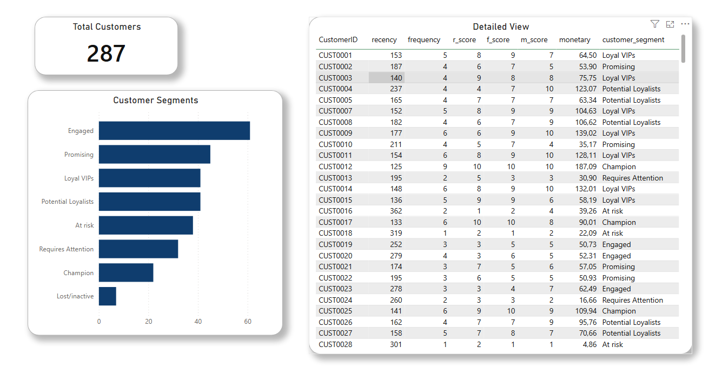

# Customer Segmentation – BigQuery & Power BI

## Problématique
Comment identifier et prioriser les clients les plus précieux pour optimiser les actions marketing ?
À partir de données de ventes 2025, ce projet segmente automatiquement les clients selon leur comportement d'achat.

## Outils utilisés
- **Google BigQuery** – stockage et transformation des données dans le cloud
- **SQL** – nettoyage, agrégation et segmentation
- **Power BI** – visualisation et dashboard interactif

## Architecture du projet
Les données ne sont pas stockées localement mais directement dans **Google BigQuery**, une base de données cloud à l'échelle enterprise. Cela implique :
- La gestion de **tables partitionnées** par mois (12 tables de ventes)
- L'écriture de **vues SQL** pour transformer les données directement en cloud
- La connexion **BigQuery → Power BI** pour un dashboard alimenté en temps réel

## Méthodologie
Le projet suit une approche en 5 étapes :

1. **Consolidation** – Fusion des 12 tables de ventes mensuelles en une seule table annuelle
2. **Calcul des métriques** – Calcul de la récence, fréquence et montant d'achat par client
3. **Scoring** – Attribution d'un score de 1 à 10 pour chaque métrique (déciles)
4. **Score total** – Agrégation des 3 scores en un score global
5. **Segmentation** – Classification des clients en 8 segments

## Segments clients
| Segment | Score total |
|---|---|
| Champion | ≥ 28 |
| Loyal VIPs | ≥ 24 |
| Potential Loyalists | ≥ 20 |
| Promising | ≥ 16 |
| Engaged | ≥ 12 |
| Requires Attention | ≥ 8 |
| At risk | ≥ 4 |
| Lost/Inactive | < 4 |

## Compétences démontrées
- **Cloud** : Google BigQuery, gestion de données à grande échelle
- **SQL** : nettoyage de données, CTEs, fonctions fenêtre (`ROW_NUMBER`, `NTILE`)
- **Power BI** : connexion live à BigQuery, dashboard interactif
- **Analyse** : segmentation comportementale clients

## Dashboard

